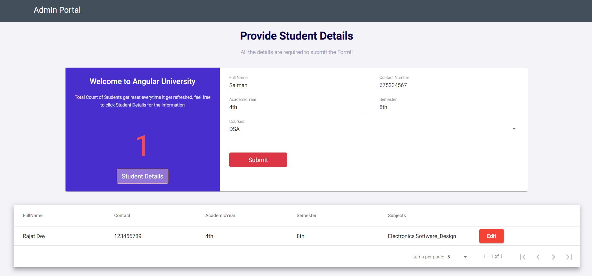

# University Admin Panel
A small project on University Admin Portal, where admin has the rights to add students, Courses. Get the list of the students and can able to edit it. 

##### Technology Stack: Angular, NodeJS(Express,Nodemon)

The whole project is divided into two parts --> 

Nodejs for development of API as a part of Backend/Server and Angular for the development of Fronted/UI Part

### Key Features:
1) Admin can input the details of the student and add it.
2) On submit necessary api calls happen and can see the count for the student added at the particular session.
3) On a single button click, Admin can find all the student list in a one go.
4) Admin can edit the student details if required, add courses in the list itself.
5) Material design is used for the whole application.
6) Pagination is added on the List.
7) Whole application is mobile responsive.


### To run the Application directly:

1) Need two terminal to open in Parallel.
2) Open first terminal under main structure of the application, where server.js file is present and run the below two commands respectively one by one:
```bash
        npm install
        npm run dev
```
3) Open the 2nd terminal under my-app structure where angular.json is present and run two commands respectively:
```bash
         npm install
         ng serve or npm run
```
## Details of the Project:

Overall Structure of the Project :

The Whole Project is Divided into Two Parts:

a) Backend -> NodeJs
b) Frontend -> Angular

1) Backend --> NodeJs is Used with Express to develop the api. Nodemon is used for development of the api where changes in api took place automatically.

CodeBase : Server.js file is added under the main folder Structure where the whole API development is Present.

To run the Server : 

1) Open the terminal under the folder structure where Server.JS file is present.
2) Type and enter - npm install --> To download the node module
3) Type and enter - npm run dev --> To run the server of the nodejs backend

b) Frontend --> Angular Framework is used to develop the UI part of the project, where multiple module are used to develop with Material Design to use in both Desktop and Mobile devices.

CodeBase : my-app project is created with cli and contains all the file and folders

To run the client:

1) open the terminal under my-app folder structure 
2) Type and enter - npm install --> To download the node module
3) Type and enter - ng serve --> To run the app on port 4200 in localhost.

You can notice that there are two node modules folder in the project such the root module folder is the parts of the Angular APP that contains all the dependency of the Application. And the node module folder which is under parent folder is the part of the NodeJS Service layer.


*Snapshot of the Developed Application :*

Snapshot 1 :


Snapshot 2: 




**Note : Multiple bugs may be present in the application, which will be solved in future updates.**
